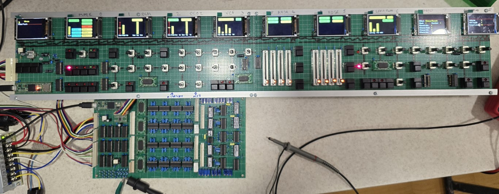

## Multiple ST7789 2" displays (9 of them) controlled by a Teensy 4.1 to display synth parameters from MIDI input

This is a sort of crazy idea that I could display all of the internal parameters of the synth I'm currently building on 9x 2" ST7789 SPI displays. 
Each display with a different section of the synth, DCO1, DCO2 etc
It's sort of working fine for parameter adjustments, but is still quite clunky on patch changes and misses parameter settings on the screen.

# Things to do

* Fix the data transfer for patches from CC to Sysex for upper and lower patches.
* Improve the layouts, its early days, but I think I can do better.
